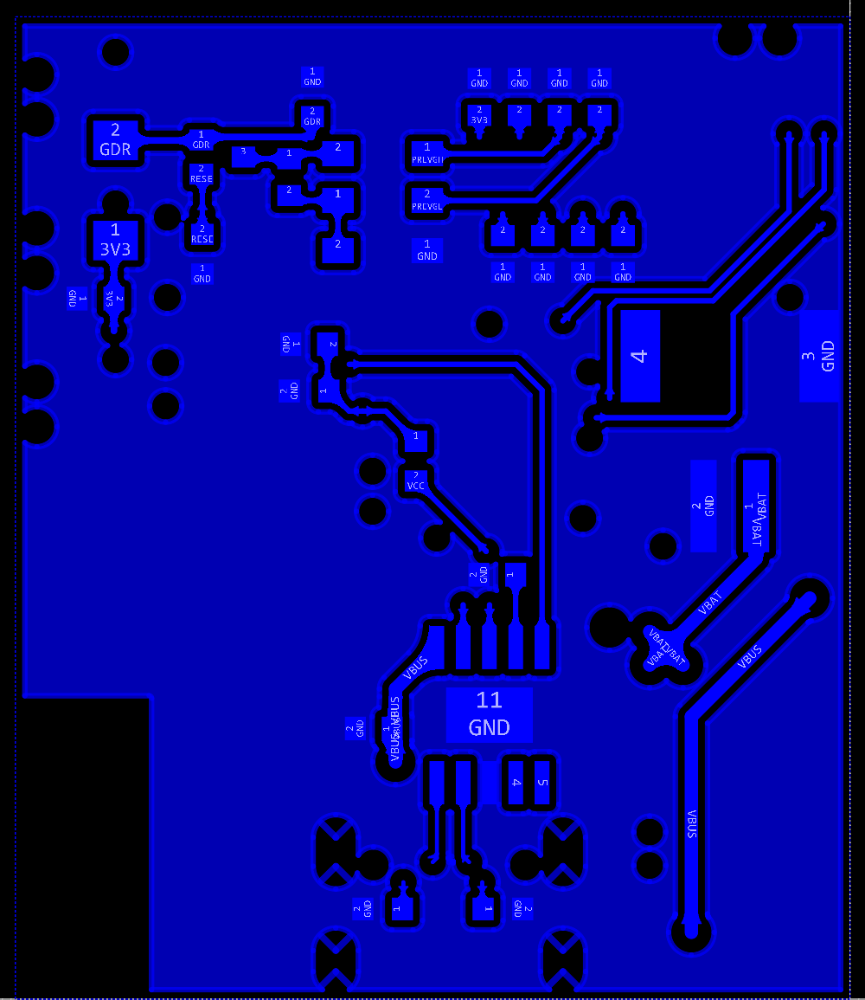

# 基于ESP32-Pico-D4的电子墨水屏设计

- [x] 硬件打样
- [ ] 软件开发
- [ ] 3D打印外壳
- [ ] 低功耗设计
- [ ] 进一步优化
- [ ] ...

[TOC]

## 硬件部分

使用立创EDA-专业版绘制原理图和PCB，嘉立创四层板免费打样。

**由于设计问题以及软件版本更新，目前正在重制V2.0版本，拟采用立创EDA专业版V2.2.34绘制。**

### 原理图

### PCB

采用4层板设计，内层分别为GND层和VCC、3.3V电源平面层。

### 3D视图

### BOM

## 软件部分

采用ESP-IDF框架。

## 外壳设计

## 低功耗设计
